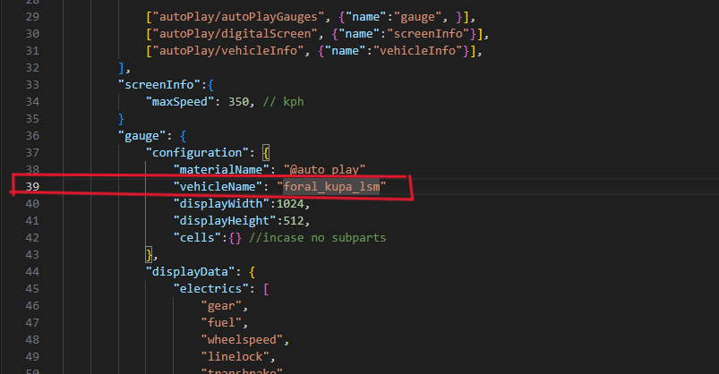

# This is the guide of using this dashboard mod. 

## Dashboard

 1. Fix "BeamNG Screens" on the car.
    

 2. Enter BeamNG and choose the car which is waiting to be modified.
    You will see the dashboard is able to display some information.
    

 3. Download the mod. And paste the files to the car folder.
    __Pay attention to the directory of the folders.__
    
    

 4. Find the "auto_play.jbeam" and "auto_play.materials.json" under the "auto_play_dash" folder in the car folder and open them.
    

 5. At the line 39 of "auto_play.jbeam", fix the quotation with the name of the car, which is the folder's name right behind the "vehicle" folder.
    

 6. At the line 38 of "auto_play.materials.json", fix the slash with the same name.
    

 7. Open the .pc file of the car which is waiting to be modified. Paste the [content](#general) to the "parts" of the file.
    

 7. Open the xxxxx_main.jbeam file of the car which is waiting to be modified. Paste the [content](#glow-map-contents) to the "glowMap" of the file. Then find the "material_xx_abscreen_race_xxxxx" and replace the "dash_board_texture" with it. After that, delete the original line of "material_xx_abscreen_race_xxxxx".
    

 8. Turn back to the game and refresh the car, the dashboard is fixed.
    

### glow map contents

```
"dash_board_texture":{"simpleFunction":{"ignitionLevel":0.5}, "off":"dash_board_texture", "on":"auto_play_gauges_screen_accessory", "on_intense":"auto_play"},
"navigator_texture":{"simpleFunction":{"consoleScreen":0.49}, "off":"navigator_texture", "on":"navi", "on_intense":"mirror_cx"},
```

### .PC files units

#### General

````
"digidash_screen_logic": "auto_play_dash_screen",
"dash_battery_display": "dash_battery_display",
"dash_fuel_display": "dash_fuel_display",
"dash_awd_display": "dash_awd_display",
"dash_rpm_display": "dash_rpm_display",
"dash_power_display": "dash_power_display",
"navi_screen": "navi_screen",
````

#### SI units

```
"dash_temperature_unit": "dash_temperature_unit_celsius"
"dash_velocity_display": "dash_velocity_unit_kph"
"battery_unit": "battery_unit_kWh"
"battery_consumption_unit": "battery_consumption_unit_kphk"
"fuel_unit": "fuel_unit_L"
"fuel_consumption_unit": "fuel_consumption_unit_lphk"
```

#### US units

```
"dash_temperature_unit": "dash_temperature_unit_fahrenheit"
"dash_velocity_display": "dash_velocity_unit_mph"
"battery_unit": "battery_unit_kWh"
"battery_consumption_unit": "battery_consumption_unit_mpge_US"
"fuel_unit": "fuel_unit_Gal_US"
"fuel_consumption_unit": "fuel_consumption_unit_mpg_US"
```

#### UK units

```
"dash_temperature_unit": "dash_temperature_unit_fahrenheit"
"dash_velocity_display": "dash_velocity_unit_mph"
"battery_unit": "battery_unit_kWh"
"battery_consumption_unit": "battery_consumption_unit_kphk"
"fuel_unit": "fuel_unit_Gal_UK"
"fuel_consumption_unit": "fuel_consumption_unit_mpg_UK"
```